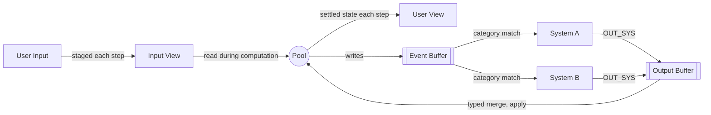

<!--
  File: docs/engine/specs/architecture-diagram.md
  Purpose: Pool-System architecture at a glance
  Audience: Agents and humans
  Update when: Top-level architecture changes
-->

# Architecture at a glance

The Pool sits at the center. User Input stages into an Input View the Pool reads mid-computation; User View reads the Pool once a Step settles. Systems are dispatched by Pool events and feed results back through typed merge.

Related: [step-lifecycle.md](step-lifecycle.md), [systems.md](systems.md), [events.md](events.md), [merge-types.md](merge-types.md).
