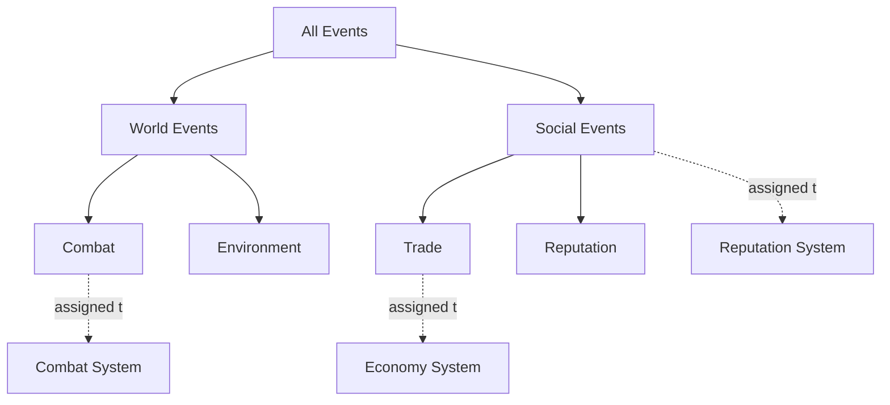

<!--
  File: docs/engine/specs/events.md
  Purpose: Event model and category tree
  Audience: Agents implementing the engine
  Update when: Event model changes
-->

# Event model

> **Code status (through F-003):** category tree, event buffer, ancestry claiming via stub `EventClaimer`, unmatched diagnostics, and no same-Step buffer refill are implemented. Claiming Systems that produce OUT_SYS / next-Step events arrive in F-004+.

## Category tree and ancestry claiming

The Pool writes each event as a notification into a shared buffer — not addressed to a specific System. Every event carries a **category** from the category tree (nested like folders). Each System is assigned one category at definition time and claims any event whose category is its own or a **descendant** at any depth.

The tree above is **illustrative**. The framework fixes ancestry-based claiming; the application defines the actual tree and how it is authored ([open-questions.md](open-questions.md)).

In the example: Reputation System is assigned to parent "Social Events" and claims Trade and Reputation; Economy System is assigned to "Trade" only.

## Unmatched events

If an event’s category matches **no** System’s assigned category (including ancestry), the engine **logs** that fact. It must not disappear without a log. (See ADR-006.)

## Cross-step propagation

If a System's output would qualify as a new event, it is **not** evaluated in the Step that produced it. It sits in the updated Pool and waits for category matching at the **start of the next Step**.

Same-Step recursive triggering is structurally impossible: the event buffer fills once per Step at Pool compute time and is not refilled before the Step ends.
