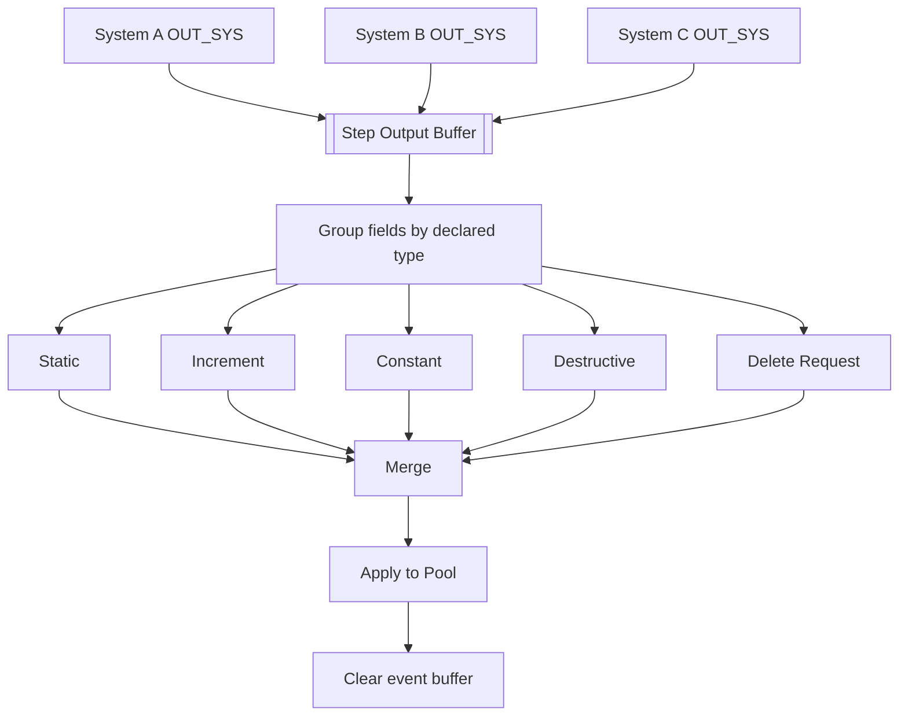

<!--
  File: docs/engine/specs/merge-types.md
  Purpose: Typed merge and field types
  Audience: Agents implementing the engine
  Update when: Merge types or resolvers change
-->

# Merge and type system

> **Code status (through F-004):** Static, Increment, Constant, and Destructive are implemented via `TypedMerge` + `FieldSchema`. Provenance is `ProvenancedWrite(systemId, value)`. Static/Destructive pick-one = lexicographically smallest `systemId`. **Delete Request** is not implemented (open question #4).

Every output field carries a type; the type defines how conflicting writes resolve.

## Field types

| Type | Behavior | Order-sensitive? | Resolution |
|------|----------|------------------|------------|
| **Static / Overwrite** | Exactly one value from the conflicting set | Yes when multiple writers | Deterministic pick-one per field; pure function of conflicting set |
| **Increment** | Accumulates every conflicting value | No (commutative sum) | None |
| **Constant** | Keeps existing value; new writes are no-ops | No | None |
| **Destructive** | Valid for one merge only; consumed when used | Yes when multiple writers | Deterministic pick-one; exactly one write valid per Step |
| **Delete Request** | Removes what the output specifies | Yes vs concurrent write | **Policy open** — [open-questions.md](open-questions.md) |

## Two tiers of conflict resolution

| | Sub-System → System | System → Pool |
|---|---------------------|---------------|
| Writers depend on each other? | Yes (buffer chaining) | No (same Pool snapshot) |
| Conflict source | Causal ordering + overlapping write-ranges | Independent Systems targeting same field |
| Resolution | Resolver Sub-System per System ([systems.md](systems.md)) | Resolver per field type, automatic |

## System-to-Pool merge flow

When every claiming System has finished, the buffer groups by type. Static, Destructive, and Delete Request fields with multiple writers run through type resolvers. Increment sums. Constant keeps standing value. Result applies in one step; event buffer clears.

## Provenance

Resolvers cannot break ties on bare values alone. Every value entering the output buffer needs **provenance** (which System produced it, or deterministic ordinal such as category-tree position). Resolver input is **(System, value)** pairs, not values alone.

## Quick reference

| Type | One-line rule |
|------|---------------|
| Static / Overwrite | Exactly one value wins, by per-field deterministic rule |
| Increment | All conflicting values sum |
| Constant | New writes are no-ops |
| Destructive | Exactly one write valid per Step; then spent |
| Delete Request | Removes specified value; conflict policy open |
