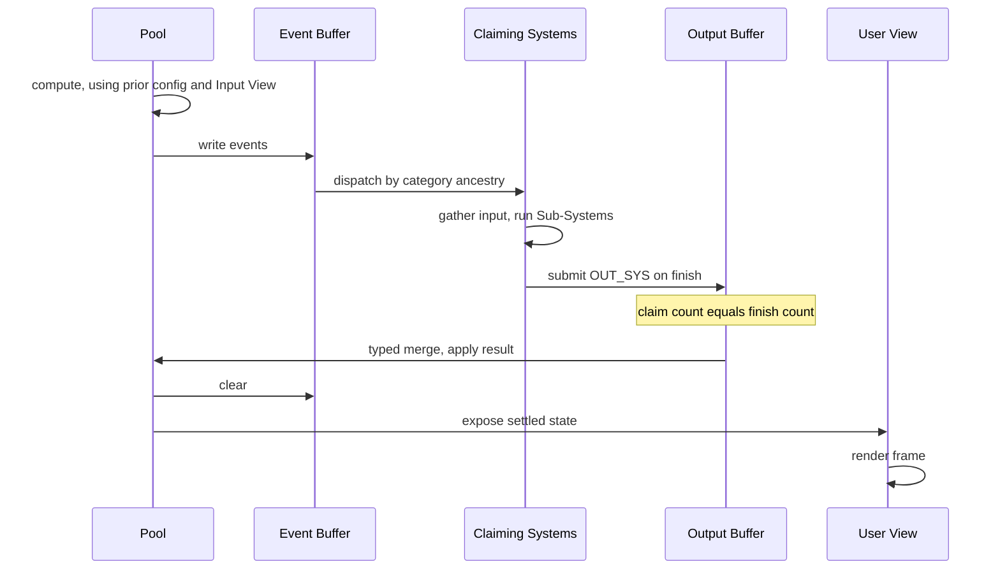

<!--
  File: docs/engine/specs/step-lifecycle.md
  Purpose: Order of operations within one Step
  Audience: Agents implementing the engine
  Update when: Step lifecycle changes
-->

# Step lifecycle

A single Step runs in this order:

> **Code status (through F-012 / G-002):** items 1–12 are implemented. Pool compute is pluggable (`PoolCompute`); emissions during compute are pluggable (`EventEmissionPolicy`). User View is a callback port; Input View is staged from `UserInput`. CLI/UI adapters are F-007–F-008. Host ports: [../architecture.md](../architecture.md).

1. The Pool computes via its wired `PoolCompute`. It reads the Input View and configuration from the previous Step, and updates its own state.
2. While computing, the Pool (via compute and/or `EventEmissionPolicy`) writes events into a shared buffer visible to every System.
3. Each System checks the buffer against its assigned category. It claims events whose category equals its own or descends from it at any depth.
4. Each claiming System pulls needed Pool data into its input buffer, then executes its Sub-Systems.
5. Within a System, Sub-Systems with disjoint declared write-ranges run without a fixed order. Overlapping ranges resolve through a conflict-resolution Sub-System ([systems.md](systems.md) § Conflict resolution).
6. Each System reports completion. The Step holds at the claim/finish barrier until every claiming System has reported.
7. Every System's output enters a shared, Step-level output buffer.
8. The output buffer groups values by declared field merge type (`FieldMergeType`) and runs resolvers for fields with more than one writer ([merge-types.md](merge-types.md)).
9. The merged result applies to the Pool. The event buffer clears.
10. Consequences that would trigger new events wait for category matching at the **next** Step — chains span Steps, never loop within one.
11. User View reads the settled Pool and renders the frame.
12. The next Step begins from Pool update (step 1) plus merged System output (step 9).

