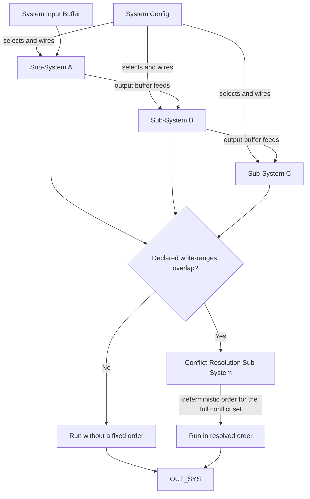

<!--
  File: docs/engine/specs/systems.md
  Purpose: Systems, Sub-Systems, composition, conflict resolution
  Audience: Agents implementing the engine
  Update when: System model changes
-->

# Systems and Sub-Systems

> **Code status (through F-004):** `EngineSystem`, `SystemConfig`, `SubSystem`, and `ConflictResolutionSubSystem` are implemented. Systems run synchronously on a shared Pool snapshot. Claim/finish barrier counters remain F-005.

## Composition: config as grammar

A System is a **System Config** plus Sub-Systems the config selects and wires — like a grammar assembling a vocabulary into a sentence. The same Sub-System pool can compose into different Systems depending only on config.

## Buffers and chaining

Each Sub-System reads an input buffer and writes an output buffer. One Sub-System's output can feed another's input (pipeline). Writes may be partial. One internal step's contribution is **Out_spec**; the System aggregate is **OUT_SYS**.

Sub-Systems can depend on each other's output, so order **can** matter within a System — unlike Systems at the layer above.

## Sub-System conflict resolution

Every Sub-System declares which output fields it can modify.

- **Disjoint ranges** — run in any order or parallel; outcome unchanged.
- **Overlapping ranges** — System config supplies a dedicated **conflict-resolution Sub-System**, triggered on conflict.

The resolver differs from fixed priority in two ways:

1. It sees actual input/output buffers of conflicting Sub-Systems — decisions can depend on data.
2. It operates on the **full conflict set** at once — one deterministic order for N-way conflicts, not pairwise.

There is no general automatic rule for arbitrary domain conflicts. Judgment is compiled once into a resolver Sub-System and reused — analogous to Git: non-overlapping edits merge automatically; genuine conflicts need a human-authored resolution, compiled here in advance.

## System independence

Systems cannot chain like Sub-Systems. Multiple Systems may claim the same event; each runs independently on the same Pool snapshot. No System reads another System's output in the same Step. See [events.md](events.md).
